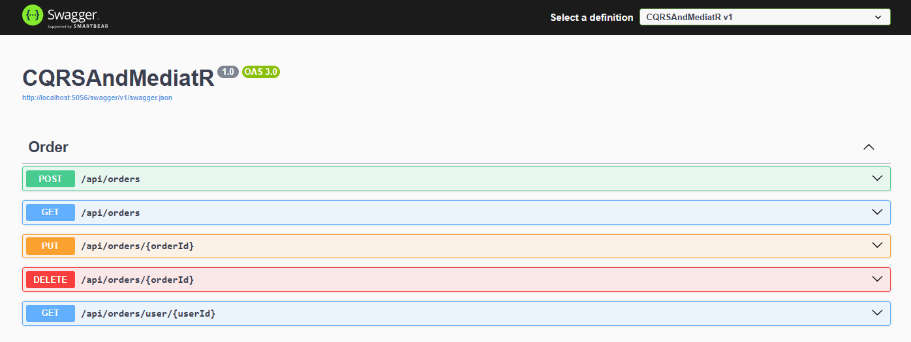

# Implementacija i upotreba CQRS obrasca u .NET aplikaciji
📜 Sadržaj:
- [Uvod](#uvod)
- [CQRS (Command Query Responsibility Segregation) obrazac](#cqrs-command-query-responsibility-segregation-obrazac)
- [Clean Architecture](#clean-architecture)
- [MediatR biblioteka](#mediatr-biblioteka)
- [Implementacija operacija pisanja (Commands)](#implementacija-operacija-pisanja-commands)
- [Implementacija operacija čitanja (Queries)](#implementacija-operacija-čitanja-queries)
- [Pokretanje i demonstracija rada aplikacije](#pokretanje-i-demonstracija-rada-aplikacije)
- [Prednosti i mane CQRS pristupa](#prednosti-i-mane-cqrs-pristupa)
- [Zaključak](#zaključak)
- [Mogućnosti daljeg razvoja](#mogućnosti-daljeg-razvoja)
  
<h2 id="uvod">📖 Uvod </h2> 

Razvoj savremenih softverskih sistema zahteva jasno strukturisanu arhitekturu koja omogućava jednostavno održavanje, proširivost i razdvajanje odgovornosti između pojedinih delova aplikacije. Jedan od arhitektonskih obrazaca koji se često koristi u takvim sistemima je CQRS (Command Query Responsibility Segregation), čija je osnovna ideja razdvajanje operacija koje menjaju stanje sistema od operacija koje služe za čitanje podataka.

U okviru ovog projekta realizovana je .NET aplikacija za upravljanje narudžbinama sa ciljem demonstracije praktične primene CQRS obrasca. Aplikacija omogućava osnovne CRUD operacije nad entitetom narudžbine, pri čemu su operacije pisanja implementirane korišćenjem komandi, dok su operacije čitanja realizovane putem upita. Za komunikaciju između kontrolera i poslovke logike korišćena je MediatR biblioteka, čime je postignuto dodatno razdvajanje slojeva i smanjena direktna zavisnost između komponenti sistema.

Projekat je organizovan u skladu sa principima Clean Architecture, kroz jasno definisane slojeve domena, aplikacione logike, infrastrukture i API sloja. Pristup bazi podataka realizovan je korišćenjem Entity Framework Core tehnologije, uz primenu migracija za upravljanje strukturom baze. Na ovaj način obezbeđena je čista separacija poslovke logike od tehničkih detalja implementacije.

Cilj rada je da se prikaže način implementacije CQRS obrasca u .NET okruženju, kao i da se ukaže na prednosti i izazove ovakvog pristupa u razvoju aplikacija srednje složenosti. Kroz praktičan primer demonstrirano je kako se CQRS može efikasno kombinovati sa MediatR bibliotekom i principima čiste arhitekture radi izgradnje održivog i proširivog softverskog rešenja.

<h2 id="cqrs-command-query-responsibility-segregation-obrazac">🏛️ CQRS (Command Query Responsibility Segregation) obrazac</h2> 

### Šta je CQRS?
CQRS je skraćenica od Command Query Responsibility Segregation (Razdvajanje odgovornosti za komande i upite). To je softverski arhitektonski obrazac koji uvodi jasno razdvajanje između operacija pisanja (commands) i operacija čitanja (queries) podataka.

U CQRS arhitekturi, operacije pisanja i operacije čitanja se obrađuju odvojeno, koristeći različite modele optimizovane za svaku vrstu operacije. Ovakvo razdvajanje može dovesti do jednostavnijih, fleksibilnijih i skalabilnijih arhitektura, naročito u složenim sistemima u kojima se obrasci čitanja i pisanja značajno razlikuju.
### Razlika od tradicionalnog CRUD pristupa
Tradicionalni arhitektonski obrasci često koriste isti model podataka ili isti DTO (Data Transfer Object) za operacije čitanja i pisanja. Iako ovakav pristup može biti adekvatan za osnovne CRUD operacije (kreiranje, čitanje, ažuriranje i brisanje), on postaje ograničavajući kada aplikacije rastu i zahtevi postaju složeniji.

U praktičnim scenarijima često postoji razlika između struktura podataka koje se koriste za čitanje i onih koje se koriste za pisanje. Na primer, za ažuriranje podataka mogu biti potrebna dodatna svojstva koja nisu relevantna prilikom čitanja. Korišćenje jednog istog DTO-a tokom celog životnog ciklusa aplikacije može ograničiti arhitekturu sistema, osim ako se ne uvedu dodatni modeli, što može povećati složenost.

Osnovna ideja CQRS obrasca jeste omogućavanje rada sa različitim modelima podataka za različite svrhe. U praksi, to znači postojanje posebnog modela za umetanje zapisa, drugog za ažuriranje zapisa i trećeg za izvršavanje upita nad podacima. Ovakav pristup omogućava veću fleksibilnost u obradi složenih scenarija i efikasniju i precizniju obradu podataka.

<h2 id="clean-architecture">🏗️ Clean Architecture</h2> 

Clean Architecture predstavlja softverski dizajnerski pristup čiji je osnovni cilj izgradnja sistema koji su dugoročno održivi, fleksibilni i otporni na promene tehnologija. Ovaj arhitektonski stil teži sledećim osobinama:

- Maintainability (održivost) – Sistem je lak za razumevanje, održavanje i izmenu, što omogućava uvođenje promena uz minimalan rizik od nastanka grešaka.

- Testability (testabilnost) – Arhitektura je projektovana tako da omogućava jednostavno testiranje, uključujući kreiranje automatizovanih testova za pojedinačne delove sistema bez potrebe za spoljašnjim zavisnostima.

- Flexibility (fleksibilnost) – Arhitektura ima mali broj zavisnosti od konkretnih tehnologija (baze podataka, veb okviri i slično), što olakšava izmene u osnovnoj poslovnoj logici sistema i uvođenje novih komponenti uz minimalno refaktorisanje.

- Scalability (skalabilnost) – Modularni dizajn omogućava lakše skaliranje sistema, jer se pojedinačni slojevi ili komponente mogu optimizovati ili proširivati nezavisno. Na ovaj način sistem može da podrži rast broja korisnika bez potrebe za potpunim redizajnom.

- Reusability (ponovna upotrebljivost) – Clean Architecture omogućava ponovnu upotrebu osnovnih poslovnih komponenti u različitim projektima ili na drugim platformama, zahvaljujući jasno definisanim zavisnostima između slojeva.

- Long-term viability (dugoročna održivost) – Sistemi zasnovani na Clean Architecture pristupu lakše se prilagođavaju razvoju programskih jezika i tehnologija, čime se obezbeđuje dugoročna relevantnost i funkcionalnost sistema.

- Ease of onboarding – Jasna podela odgovornosti i struktura sistema olakšavaju razumevanje arhitekture novim programerima, smanjujući vreme potrebno za uvođenje u projekat i povećavajući njihovu produktivnost.

### Principi Clean Architecture

Clean Architecture se zasniva na skupu osnovnih principa čiji je cilj kreiranje softverskih sistema koji su održivi, skalabilni i laki za razumevanje.
- Pravilo zavisnosti (Dependency Rule) - Zavisnosti u sistemu treba da budu usmerene ka unutra, što znači da unutrašnji slojevi ne smeju zavisiti od spoljašnjih slojeva. Drugim rečima, osnovna poslovna logika aplikacije ne sme zavisiti od korisničkog interfejsa, baze podataka ili drugih infrastrukturnih komponenti. Ovo pravilo smanjuje povezanost (decoupling) i povećava fleksibilnost sistema.

- Testabilnost (Testability) - Arhitektura treba da olakša testiranje poslovnih pravila. Apstrahovanjem pristupa spoljašnjim servisima i resursima omogućava se pisanje kvalitetnih jediničnih testova, pri čemu se osnovna logika može testirati bez oslanjanja na bazu podataka, mrežu ili druge eksterne zavisnosti.

- Nezavisnost od spoljašnjih sistema (Independence of External Agencies) - Način funkcionisanja sistema ne bi trebalo da zavisi od spoljašnjih sistema. Ovim se omogućava razvoj i testiranje poslovne logike bez potrebe za uključivanjem eksternih elemenata, kao i veća stabilnost sistema nezavisno od stanja spoljašnjih komponenti.

### Slojevita struktura Clean Architecture

Clean Architecture predstavlja slojevitu arhitekturu koja deli sistem na četiri osnovna sloja, pri čemu svaki sloj ima jasno definisanu odgovornost i smer zavisnosti:
- Domain                  
- Application
- Infrastructure
- Presentation
  
<p align="center">
  
</p>

### Domain sloj
Domain sloj se nalazi u samom jezgru Clean Architecture. U ovom sloju se definišu osnovni koncepti domena, kao što su:
- entiteti (Entities),
- objekti vrednosti (Value Objects),
- agregati (Aggregates),
- domen događaji (Domain Events),
- izuzeci (Exceptions),
- interfejsi repozitorijuma (Repository Interfaces),
- zajedničke (deljene) klase i apstrakcije.


Primer strukture direktorijuma za Domain sloj može izgledati na sledeći način:

Važno je naglasiti da Domain sloj **ne sme** imati reference ka drugim projektima u okviru rešenja. On mora ostati potpuno nezavisan od aplikacionog, infrastrukturnog i prezentacionog sloja, čime se obezbeđuje čista i stabilna poslovna logika sistema.

### Application Layer (Aplikacioni sloj )
Aplikacioni sloj se nalazi neposredno iznad domenskog sloja i funkcioniše kao orkestrator poslovne logike. Njegova uloga je da definiše i upravlja najvažnijim slučajevima upotrebe (use cases) aplikacije.
U ovom sloju implementacija slučajeva upotrebe može se organizovati na dva načina:
- Servisi – klase koje grupišu logiku za određene operacije.
- CQRS pristup – korišćenje komandi (Commands) za operacije koje menjaju stanje sistema i upita (Queries) za operacije čitanja podataka.
Aplikacioni sloj je odgovoran za koordinaciju između slojeva, ali ne sadrži direktnu poslovnu logiku, koja pripada domenskom sloju.

### Infrastructure Layer (Infrastrukturni sloj)
Infrastrukturni sloj implementira servise koji omogućavaju interakciju sa spoljašnjim sistemima i resursima. Ovaj sloj pruža konkretne implementacije apstrakcija definisanih u aplikacionom ili domenskom sloju.
Primeri komponenti u infrastrukturnom sloju:
- Baze podataka – PostgreSQL, MongoDB
- Provajderi identiteta – Auth0, Keycloak
- Servisi za slanje elektronske pošte
- Servisi za skladištenje podataka – AWS S3, Azure Blob Storage
- Redovi poruka – RabbitMQ

### Presentation Layer (Prezentacioni sloj)
Prezentacioni sloj predstavlja ulaznu tačku u sistem i omogućava komunikaciju korisnika ili drugih sistema sa aplikacijom. Najčešće se implementira kao Web API ili drugi interfejs (npr. GUI, gRPC).
Najvažniji deo prezentacionog sloja su:
- Kontroleri (Controllers) – definišu API krajnje tačke (endpoints) i obrađuju dolazne zahteve.
- DTO-ovi (Data Transfer Objects) – objekti koji prenose podatke između klijentskog i serverskog dela, odvajajući ih od domenskih entiteta.
Prezentacioni sloj ne sadrži poslovnu logiku, već delegira sve operacije aplikacionom sloju.

<h2 id="mediatr-biblioteka"> 🚚 MediatR biblioteka</h2>
MediatR je popularna open-source biblioteka u .NET okruženju, namenjena implementaciji **Mediator** obrasca u .NET aplikacijama. Mediator obrazac je bihejvioralni dizajnerski obrazac koji ima za cilj smanjenje direktne povezanosti između komponenti sistema tako što uvodi posrednički objekat (mediator) koji upravlja komunikacijom među njima.

### Ključne funkcije i prednosti:
- Centralizuje komuniakciju - mediator preuzima odgovornost za prosleđivanje poruka između komponenti.
- Smanjuje zavisnosti - komponente ne zavise direktno jedna od druge, već samo od mediatora.
- CQRS - omogućava jasno razdvajanje operacija koje menjaju stanje sistema (Commands) od operacija koje služe isključivo za čitanje podataka (Queries).
- Lakše testiranje – Handleri se mogu testirati izolovano, što olakšava pisanje jediničnih testova.
- Podrška za različite obrasce - Mediator može da upravlja request-response komunikacijom, notifikacijama događaja (event notification) i drugim obrazcima.

### Princip rada
- Definiše zahtev (Command ili Query) - objekat koji opisuje operaciju koju želite da izvršite.
- Definište rukovaoca (Handler) - klasa koja sadrži logiku za obradu zahteva.
- Slanje zahteva mediatoru - pozivom metode _mediator.Send(myCommand)
- Rukovanje zahtevom - mediator pronalazi odgovarajući handler i prosleđuje mu zahtev na izvršenje.

<h2 id="implementacija-operacija-pisanja-commands">📝 Implementacija operacija pisanja (Commands)</h2>
U okviru CQRS pristupa, operacije koje menjaju stanje sistema realizuju se pomoću komandi (Commands). Komanda predstavlja objekat koji opisuje željenu akciju nad sistemom, ali ne sadrži samu poslovnu logiku — ona se delegira odgovarajućem handler-u u aplikacionom sloju.
Primer toka izvršenja komande

**1. Kreiranje komande**
   Kontroler inicira operaciju kreiranjem instance komande koja sadrži sve neophodne podatke za izvršenje poslovnog slučaja upotrebe.
   ```bash
   namespace Application.Commands;

   public record CreateOrderCommand(string productName, int userId, decimal totalAmount) : IRequest<int>;
   ```
**2. Slanje komande mediatoru **
   Komanda se prosleđuje MediatR mediatoru, koji preuzima odgovornost za njeno dalje procesiranje.
   ```bash
   [HttpPost]
   public async Task<IActionResult> Create(CreateOrderCommand command)
   {
       var id = await _mediator.Send(command);
       return Ok(id);
   }
   ```
**3. Izvršenje handler-a**
   MediatR pronalazi odgovarajući handler i prosleđuje mu komandu. Handler sadrži poslovnu logiku za kreiranje narudžbine i komunicira sa repozitorijumom definisanim u aplikacionom sloju.
   public class CreateOrderCommandHandler : IRequestHandler<CreateOrderCommand, int>
   ```bash
   using Application.Interfaces;
   using Domain.Entities;
   using Domain.Enums;
   using MediatR;
   {
       private readonly IOrderRepository _orderRepository;
    
       public CreateOrderCommandHandler(IOrderRepository orderRepository)
       {
            _orderRepository = orderRepository;
       }
       public async Task<int> Handle(CreateOrderCommand request, CancellationToken cancellationToken)
       {
            var newOrder = new Order
            {
                ProductName = request.productName,
                TotalAmount = request.totalAmount,
                UserId = request.userId,
                Created = DateTime.UtcNow,
                Status = OrderStatus.Created
            };
    
            return await _orderRepository.CreateAsync(newOrder);
        }
    }
   ```
**4. Povratna vrednost** 
Handler vraća rezultat izvršene operacije (identifikator novokreirane narudžbine), koji se zatim preko MediatR-a prosleđuje kontroleru i vraća klijentu kao odgovor na HTTP zahtev.

Kroz ovakav pristup postiže se jasna separacija odgovornosti, olakšano testiranje i mogućnost skaliranja poslovne logike bez direktnog uplitanja prezentacionog sloja u domenske entitete.
<h2 id="implementacija-operacija-čitanja-queries">🔎 Implementacija operacija čitanja (Queries)</h2> 
U CQRS pristupu, operacije koje služe za čitanje podataka realizuju se pomoću upita (Queries). Upit predstavlja objekat koji opisuje zahtev za podatke, bez menjanja stanja sistema. Logika obrade upita implementira se u odgovarajućem handler-u, dok prezentacioni sloj samo prosleđuje zahtev.
### Primer toka izvršenja upita
1. Kreiranje upita – kontroler ili servis kreira instancu Query objekta sa potrebnim parametrima (npr. ID entiteta, filter kriterijum).
```bash
namespace Application.Queries;

public record GetOrderQuery(int Id) : IRequest<Order>;
```
2. Slanje upita mediatoru – Query se prosleđuje MediatR mediatoru.
```bash
 [HttpGet]
 public async Task<Order> Get(int id)
 {
     var result = await _mediator.Send(new GetOrderQuery(id));

     return result;
 }
``` 
3. Izvršenje handler-a – mediator prosleđuje Query odgovarajućem handler-u, koji dohvaća podatke iz repozitorijuma, vrši mapiranje u DTO ili filtriranje, i priprema rezultat.
```bash
using Application.Interfaces;
using Domain.Entities;
using MediatR;

namespace Application.Queries;

public class GetOrderQueryHandler : IRequestHandler<GetOrderQuery, Order>
{
    private readonly IOrderRepository _orderRepository;

    public GetOrderQueryHandler(IOrderRepository orderRepository)
    {
        _orderRepository = orderRepository;
    }

    public async Task<Order> Handle(GetOrderQuery request, CancellationToken cancellationToken)
    {
        return await _orderRepository.GetByIdAsync(request.Id);
    }
}
```  
4. Povratna vrednost – handler vraća rezultat (npr. entitet, lista entiteta ili agregirani podaci), koji se prosleđuje kontroleru i korisniku.

<h2 id="pokretanje-i-demonstracija-rada-aplikacije">🚀 Pokretanje i demonstracija rada aplikacije</h2>  

Da biste pokrenuli lokalno, potrebno je imati instalirane sledeće alate:
- .NET 8 SDK
- SQL Server
- Visual Studio 2022
- ```dotnet tool install --global dotnet-ef ```

## NuGet paketi
Svi NuGet paketi korišćeni u projektu definisani su u .csproj fajlovima i automatski se preuzimaju prilikom ```dotnet restore``` ili ```dotnet build``` komande. Sledeći spisak paketa dat je informativno, radi boljeg razumevanja korišćenih tehnologija.

**API (CQRSAndMediatR.Api)**
- MediatR
- Microsoft.EntityFrameworkCore.Design
- Swashbuckle.AspNetCore
- Swashbuckle.AspNetCore.Annotations
  
**Application (CQRSAndMediatR.Application)**
- MediatR
  
**Infrastructure (CQRSAndMediatR.Infrastructure)**
- Microsoft.EntityFrameworkCore
- Microsoft.EntityFrameworkCore.SqlServer
- Microsoft.AspNetCore.Identity.EntityFrameworkCore
- Microsoft.EntityFrameworkCore.Tools
### Instalacija paketa ###
**API:**
```bash
dotnet add CQRSAndMediatR.Api package MediatR
dotnet add CQRSAndMediatR.Api package Microsoft.EntityFrameworkCore.Design
dotnet add CQRSAndMediatR.Api package MediatR.Extensions.Microsoft.DependencyInjection
dotnet add CQRSAndMediatR.Api package Swashbuckle.AspNetCore
```
**Application:**
```bash
dotnet add CQRSAndMediatR.Application package MediatR
```
**Infrastructure:**
```bash
dotnet add CQRSAndMediatR.Infrastructure package Microsoft.EntityFrameworkCore
dotnet add CQRSAndMediatR.Infrastructure package Microsoft.EntityFrameworkCore.SqlServer
dotnet add CQRSAndMediatR.Infrastructure package Microsoft.AspNetCore.Identity.EntityFrameworkCore
dotnet add CQRSAndMediatR.Infrastructure package Microsoft.EntityFrameworkCore.Tools
```
### Konekcija sa bazom ###
Prilikom prvog pokretanja projekta lokalno, potrebno je kreirati bazu podataka primenom Entity Framework Core migracija. Migracije automatski generišu potrebne tabele na osnovu definisanih entiteta u domenskom sloju.
```bash
dotnet ef database update \
  --project CQRSAndMediatR.Infrastructure \
  --startup-project CQRSAndMediatR.Api
```
## Pokretanje API-ja
Idite u API projekat:
```bash
cd CQRSAndMediatR
```
Pokrenite aplikaciju:
```bash
dotnet run
```
Nakon uspešnog pokretanja, aplikacija je dostupna lokalnom URL-u, npr: [http://localhost:5056/swagger/index.html](http://localhost:5056/swagger/index.html)
Tamo možete:
- Kreirati narudžbine (POST /api/orders)
- Izmeniti narudžbine (PUT /api/orders/{orderId})
- Obrišete narudžbine (DELETE /api/orders/{orderId})
- Dohvatiti narudžbine (GET /api/orders)
- Dohvatiti narudžbine po UserId-u (GET /api/orders/user/{userId})



<h2 id="prednosti-i-mane-cqrs-pristupa">Prednosti i mane CQRS pristupa</h2>  
### 🛠️ Problemi koje CQRS rešava
- Pojednostavljeni objekti za prenos podataka - CQRS obrazac pojednostavljuje model podataka aplikacije korišćenjem odvojenih modela za svaku vrstu operacije, čime povećava flekisbilnost i smanjuje složenost.
- Skalabilnost - Odvajanjem operacija čitanja i pisanja, CQRS omogućava lakšu skalabilnost. Moguće je nezavisno skalirati stranu za čitanje i stranu za pisanje aplikacije kako bi se efikasno obradili različiti nivoi opterećenja.
- Poboljšanje performansi - S obzirom na to da operacija čitanja učestalije od operacije pisanja, CQRS omogućava optimizaciju performansi čitanja primenom mehanizma keširanja, kao što su Redis ili MongoDB. Ovaj obrazac prirodno podržava tavke optimizacije, što doprinosti boljim ukupnim performansama sistema
- Poboljšana konkurentnost i paralelizam - Korišćenjem posebnih modela za različite tipove operacija, CQRS obezbeđuje bezbedno izvršavanje paralelnih operacija uz očuvanje integriteta podataka. Ovo je naročito značajno u sistemima u kojima se veliki broj operacija izvršava istovremeno.
- Povećana bezbednost - Razdvojeni pristup koji CQRS primenjuje doprinosti boljoj kontroli pristupa podacima. Jasno definisane granice između operacije čitanja i pisanja omogućavaju implementaciju preciznijih mehanizama autorizacije, čime se unapređuje ukupna bezbednost aplikacije.
### ⚠️ Nedostaci CQRS obrasca
- Povećana složenost i obim koda – Implementacija CQRS obrasca često dovodi do povećanja složenosti sistema i količine potrebnog koda. Ovaj nedostatak proizilazi iz potrebe za održavanjem odvojenih modela i handler-a za operacije čitanja i pisanja, što može otežati razvoj, testiranje i otklanjanje grešaka.

- Veća složenost arhitekture – Uvođenje CQRS obrasca zahteva pažljivo planiranje i koordinaciju između različitih komponenti sistema, što može biti izazov u manjim timovima ili jednostavnijim projektima.

Iako CQRS povećava složenost, mnoge aplikacije opravdavaju ovaj nedostatak kroz prednosti poput nezavisne optimizacije za čitanje i pisanje, skalabilnosti i dugoročne održivosti sistema.

<h2 id="zaključak"> Zaključak </h2>

Implementacija CQRS obrasca u .NET aplikaciji uz korišćenje MediatR biblioteke omogućava jasno razdvajanje operacija čitanja i pisanja, što doprinosi modularnosti, testabilnosti i održivosti sistema. Kroz slojevitu arhitekturu (Domain, Application, Infrastructure i Presentation) postignuta je odvojena odgovornost slojeva, gde prezentacioni sloj prosleđuje zahteve aplikacionom sloju, dok se poslovna logika i pristup podacima implementiraju u handler-ima komandi i upita.
Ovaj pristup omogućava:
- bolju organizaciju i preglednost koda
- lakše testiranje pojedinačnih komponenti
- mogućnost skaliranja i nadogradnje sistema bez velikih promena postojećih slojeva.
<h2 id="mogućnosti-daljeg-razvoja">Mogućnosti daljeg razvoja</h2>

Dalji razvoj sistema može se ostvariti kroz dodavanje novih komandi i upita, integraciju sa složenijim domenima i primenu event-driven arhitekture. Moguća je i integracija sa modernim front-end framework-ovima te automatizacija testiranja i uvođenje CI/CD procesa, čime se obezbeđuje skalabilna, fleksibilna i dugoročno održiva aplikacija sa modularnom arhitekturom i jasnom separacijom odgovornosti.
